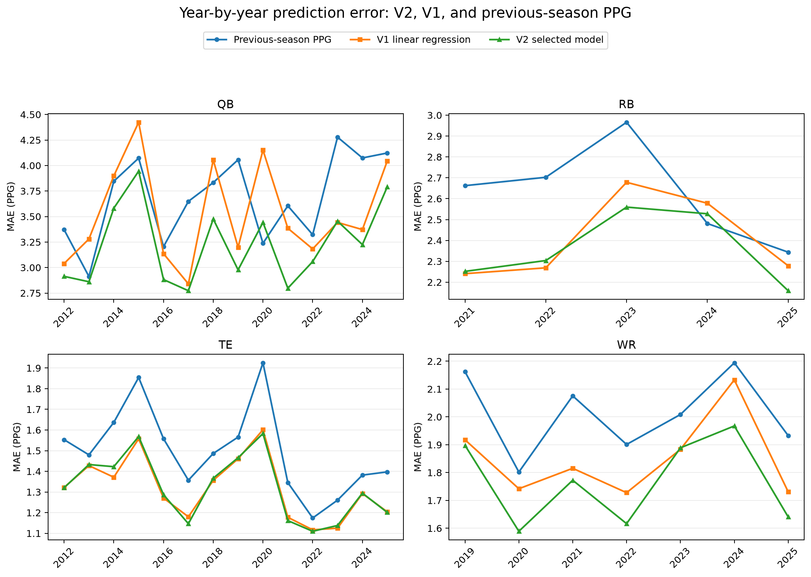
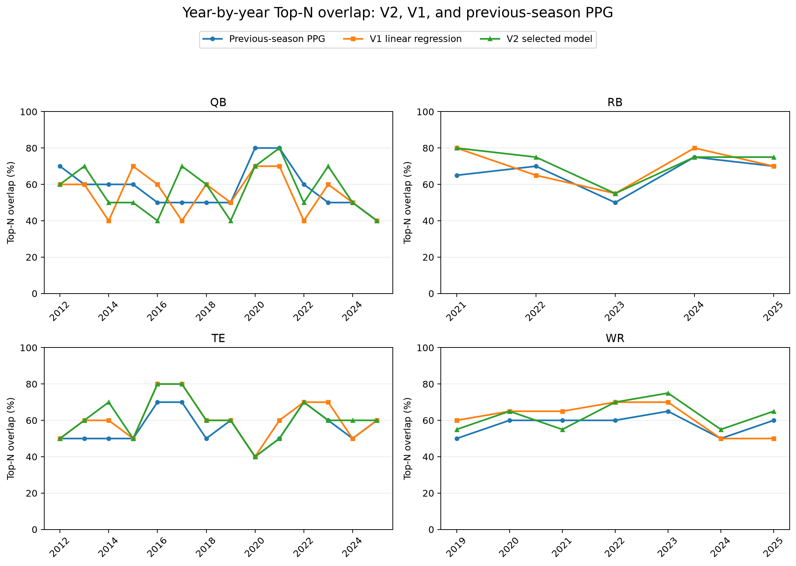
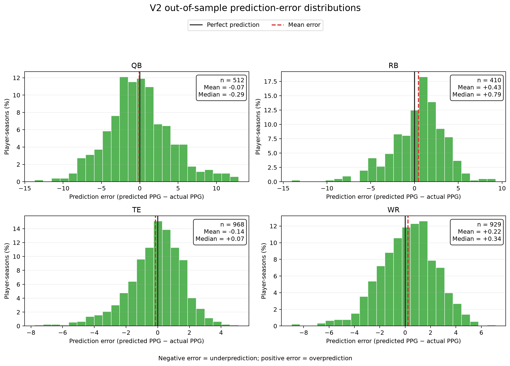

# Post-Selection Evaluation of V2

Once V2 had been selected as the final linear-regression model, an additional
round of testing was completed to provide a clearer picture of how the model
performed. These tests were not used to search for more features or to choose
between candidate versions. Instead, they were performed after model selection
to examine V2 from three complementary perspectives: year-to-year stability,
the distribution of its prediction errors, and its ability to rank players
relative to the preseason fantasy-football market.

## Year-by-Year Performance

The first analysis measured mean absolute error (MAE) separately in every
evaluation season. V2 was compared with both V1 and the original baseline of
using each player's previous-season PPG as the prediction. Lower MAE indicates
more accurate numerical predictions.

| Position | Evaluation seasons | Previous-season PPG mean MAE | V1 mean MAE | V2 mean MAE | Seasons V2 beat V1 | Seasons V2 beat previous PPG |
|---|---:|---:|---:|---:|---:|---:|
| QB | 14 | 3.6846 | 3.5320 | **3.2270** | 13/14 | 13/14 |
| RB | 5 | 2.6311 | 2.4089 | **2.3603** | 3/5 | 4/5 |
| TE | 14 | 1.4982 | **1.3188** | 1.3213 | 6/14 | 14/14 |
| WR | 7 | 2.0109 | 1.8500 | **1.7675** | 6/7 | 7/7 |

The year-by-year results show that V2's aggregate improvements were generally
supported by repeated seasonal performance rather than one unusually successful
year. The clearest result was at quarterback, where V2 produced lower MAE than
V1 and the previous-season baseline in 13 of 14 seasons. V2 also improved on V1
in six of seven wide-receiver seasons and beat the previous-season baseline in
every evaluated wide-receiver season. Running-back results covered only five
seasons, but V2 still produced the lowest mean MAE and beat the original
baseline in four of those five seasons.

Tight end remained the closest comparison. V2's mean MAE was 1.3213 PPG,
compared with 1.3188 for V1, a difference of only 0.0025 PPG. V2 nevertheless
beat the previous-season baseline in all 14 seasons. This reinforces the earlier
conclusion that tight-end performance is difficult to improve with broad
contextual features and that the final constrained adjustment changed the model
only modestly.

The second year-by-year analysis considered Top-N overlap. This statistic asks
how many of the players predicted to finish near the top of their position
actually finished there. Top 10 was used for quarterbacks and tight ends, while
Top 20 was used for running backs and wide receivers. Higher values are better.

| Position | Previous-season PPG mean overlap | V1 mean overlap | V2 mean overlap |
|---|---:|---:|---:|
| QB | **57.9%** | 55.0% | 57.1% |
| RB | 66.0% | 70.0% | **72.0%** |
| TE | 55.7% | **60.7%** | **60.7%** |
| WR | 57.9% | 61.4% | **62.9%** |

V2 achieved the highest mean Top-N overlap for running backs and wide
receivers, tied V1 for tight ends, and remained close to the previous-season
baseline for quarterbacks. The quarterback result illustrates why Top-N
overlap and MAE measure different aspects of performance: V2 made substantially
more accurate PPG predictions without always changing which quarterbacks fell
inside the Top 10.

Coverage differs by position because the final V2 features were not available
over the same historical period for every model. Quarterback and tight-end
results cover 2012–2025, wide receiver covers 2019–2025, and running back covers
2021–2025. Conclusions about the shorter running-back and wide-receiver trends
should therefore be treated more cautiously.

## Distribution of V2 Prediction Errors

MAE describes the typical size of an error but does not show whether errors are
balanced around zero. A residual histogram was therefore created for each
position using the signed prediction error:

**Prediction error = predicted PPG − actual PPG**

Negative values represent underprediction, positive values represent
overprediction, and zero represents a perfect prediction. The black vertical
line marks zero and the dashed red line marks the mean error.

| Position | Player-seasons | Mean error | Median error | Error standard deviation | Minimum error | Maximum error |
|---|---:|---:|---:|---:|---:|---:|
| QB | 512 | −0.07 | −0.29 | 4.22 | −13.71 | +12.90 |
| RB | 410 | +0.43 | +0.79 | 3.02 | −14.05 | +9.26 |
| TE | 968 | −0.14 | +0.07 | 1.74 | −7.76 | +5.11 |
| WR | 929 | +0.22 | +0.34 | 2.22 | −8.95 | +7.12 |

All four distributions were centred reasonably close to zero. Quarterback and
tight-end predictions showed almost no overall directional bias. Running backs
were overpredicted by an average of 0.43 PPG, while wide receivers were
overpredicted by 0.22 PPG. These biases are small relative to the typical spread
of the errors, although the running-back result suggests a mild tendency to
forecast more production than players ultimately achieved.

The histograms also demonstrate the differences in positional predictability.
Tight-end errors were the most tightly concentrated, with a standard deviation
of 1.74 PPG. Quarterbacks had the widest distribution at 4.22 PPG and the most
extreme errors in both directions. This is consistent with the larger scoring
scale and greater year-to-year volatility of quarterback fantasy production.

## Comparison with Historical Preseason ADP

The final evaluation compared V2's player rankings with historical preseason
Average Draft Position (ADP) from Fantasy Football Calculator. Twelve-team
non-PPR ADP was used to match the project's standard-scoring format. Each
position-season comparison was restricted to players appearing in both the V2
evaluation cohort and the historical ADP data, ensuring that both methods were
evaluated on identical players.

ADP is historically one of the strongest predictors of fantasy-football
performance. It aggregates the decisions of many fantasy managers and therefore
captures a broad collection of preseason information, including expected roles,
injuries, depth-chart movement, team changes, and contemporary football
analysis. This makes ADP a much more demanding benchmark than simply carrying
forward the previous season's PPG. Coming close to ADP is therefore a meaningful
result for V2, even in positions where the market retained a small advantage.

| Position | Method | Seasons | Player-seasons | Mean Spearman | Mean rank MAE | Mean Top-N overlap |
|---|---|---:|---:|---:|---:|---:|
| QB | Historical ADP | 13 | 258 | **0.4927** | **4.5067** | **65.4%** |
| QB | V2 | 13 | 258 | 0.3555 | 5.1909 | 64.6% |
| RB | Historical ADP | 4 | 189 | **0.6753** | **8.2155** | 71.3% |
| RB | V2 | 4 | 189 | 0.6699 | 8.5746 | **73.8%** |
| TE | Historical ADP | 13 | 216 | 0.5221 | 3.5966 | 70.0% |
| TE | V2 | 13 | 216 | **0.5454** | **3.4548** | **73.1%** |
| WR | Historical ADP | 6 | 327 | **0.6244** | **10.5673** | **69.2%** |
| WR | V2 | 6 | 327 | 0.5805 | 11.0377 | 63.3% |

ADP was the stronger overall ranking method for quarterbacks and wide
receivers. Even so, V2's quarterback Top-10 overlap was less than one percentage
point behind ADP. Running-back results were particularly close: ADP had a
slightly higher Spearman correlation and lower rank MAE, while V2 produced the
better Top-20 overlap. The tight-end model produced the strongest result against
the market. V2 exceeded ADP on all three aggregate ranking measures and achieved
a higher seasonal Spearman correlation in nine of 13 seasons.

Historical ADP was available through 2024, so the ADP comparison does not
include 2025. Its finite draft pool also excludes many low-volume players who
appear in the broader V2 evaluation cohort. The results should consequently be
interpreted as a comparison among fantasy-relevant players with recorded ADP,
not as an evaluation of every player predicted by V2.

## Overall Interpretation

This post-selection testing supports the choice of V2 as the final linear model.
The year-by-year analysis shows repeated numerical improvements over V1 for
quarterbacks, running backs, and wide receivers, rather than improvements driven
by a single season. Top-N performance was generally maintained or improved,
and the residual distributions show that V2's errors remain centred close to
zero without severe systematic overprediction or underprediction. Finally, V2
performed competitively against historical ADP—one of the strongest available
preseason predictors—and surpassed it for tight ends. V2 does not consistently
outperform the collective fantasy market, but approaching that benchmark while
using a reproducible statistical model represents a strong result.
